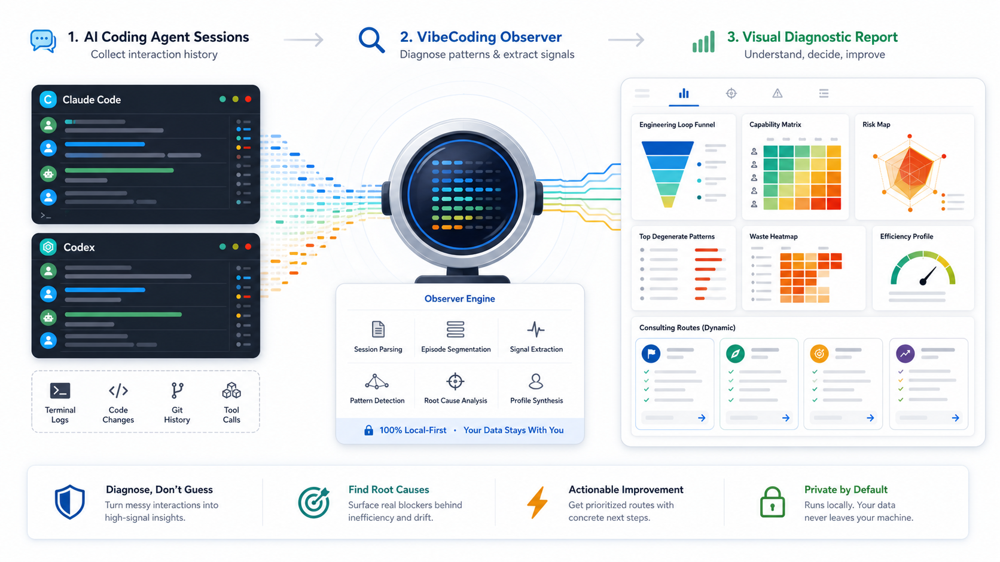
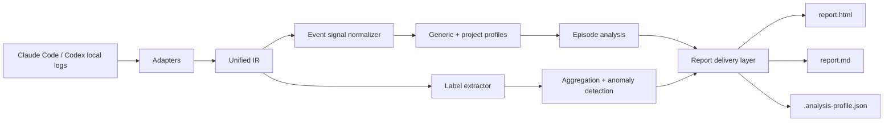
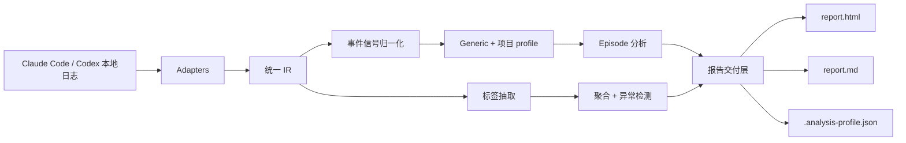

<a id="english"></a>

**English** | [中文](#中文)

<div align="center">

# VibeCoding Observer

**Local-first diagnostics for vibe coding drift.**

Read AI coding session history, measure the gap between an LLM's default
thinking path and the engineering fast lane, and turn observed drift into an
actionable diagnostic report.


<a href="LICENSE"></a>

<a href="https://github.com/HaipingShi/vibecoding-observer/actions/workflows/ci.yml"></a>
<a href="https://github.com/HaipingShi/vibecoding-observer/actions/workflows/demo-report.yml"></a>
<a href="https://github.com/HaipingShi/vibecoding-observer/stargazers"></a>


</div>



---

> **TL;DR** — VibeCoding Observer is the diagnostic side of AI coding
> governance. It does not prevent drift before work starts; it measures the
> drift that already happened.

## The Problem It Solves

AI coding agents can produce code quickly while silently drifting away from
engineering judgment: stopping at "it works", editing the wrong abstraction
layer, repeating blind fixes, skipping verification, or confusing knowledge
with capability.

Commits and PRs rarely show that process failure. VibeCoding Observer reads
local Claude Code / Codex session logs and makes the interaction pattern
visible.

## Who It's For

- **Developers using AI coding agents on real multi-session projects** who want
  to know why collaboration becomes grindy, directionless, or hard to control.
- **Skill / agent authors** who need evidence before designing better prompts,
  instructions, or governance flows.
- **Researchers and tool builders** who want a local, auditable signal layer for
  AI coding collaboration.

It is not for ranking developers, scoring teams, or uploading private coding
history.

## How It Works

```text
Claude Code / Codex logs
        ↓
Adapters → unified IR → Federator
        ↓
Extractor: 28 labels across closed diagnostic dimensions
        ↓
Aggregation + anomaly detection + episode analysis
        ↓
report.html + report.md + .analysis-profile.json
```



The extractor uses **28 labels** across degradation, activation, waste, and
efficiency signals. These are closed diagnostic labels, not free-form model
judgments and not "28 degradation modes".

The pipeline is local-first: no runtime dependencies, no network upload, and no
LLM call inside the diagnostic engine. The consuming AI agent can read the
output and do the higher-level interpretation.

## Install

The canonical distribution package is `vibecoding-observer`, the canonical CLI
is `vibecoding-observer`, and the canonical Python import package is
`observer`. Do not install the PyPI package named `agentlens`; it is not this
project.

From PyPI:

```bash
python -m pip install vibecoding-observer
vibecoding-observer --version
```

From source:

```bash
git clone https://github.com/HaipingShi/vibecoding-observer.git
cd vibecoding-observer
uv sync --extra dev
uv run vibecoding-observer --version
```

Run commands from the source checkout with `uv run`:

```bash
uv run vibecoding-observer --current-project --source all --output ./my-report
```

## Usage

```bash
vibecoding-observer --current-project --source all --output ./my-report
open ./my-report/report.html
```

Scan scope is explicit:

```bash
vibecoding-observer --current-project --source all --output ./my-report
vibecoding-observer --project /path/to/project --source all --output ./my-report
vibecoding-observer --all-history --source all --output ./my-report
vibecoding-observer --current-project --source all --output ./my-report --report-language zh
```

If no scope flag is provided, an interactive terminal asks which scope to use.
In non-interactive agent runs, the safer default is the current project.

Output files:

| File | Audience | Purpose |
|---|---|---|
| `report.html` | Human reader | Visual diagnosis, readable labels, risks, capability matrix, and consulting routes |
| `report.md` | Human / agent deep read | Evidence-rich report with anomaly fragments and Section VII diagnoses |
| `.analysis-profile.json` | Agent runtime | Structured `state / trace / guide`, including `consulting_routes` and `consulting_output` contracts |
| `share-card.svg` | Optional sharing artifact | Standalone positive share card generated with `--export-share-card` or `--share-card-svg PATH` |

Export the screenshot-friendly share card as a standalone SVG:

```bash
vibecoding-observer --current-project --source all --output ./my-report --export-share-card
vibecoding-observer --current-project --source all --share-card-svg ./share-card.svg
```

The report delivery language defaults to `auto` and is detected from local
session text. Use `--report-language zh` or `--report-language en` to force the
user-facing HTML/share-card language.

## Example Report

The repository includes a synthetic, privacy-safe demo workflow:

- [Demo Report workflow](https://github.com/HaipingShi/vibecoding-observer/actions/workflows/demo-report.yml)
- It generates `report.html` and `report.md` from test fixture sessions.
- It uploads the generated files as a GitHub Actions artifact.
- When the workflow is manually run with `publish_pages=true` and GitHub Pages
  is configured for Actions, it also publishes the demo report as a Pages site.

No real Claude Code or Codex user logs are committed or uploaded by this demo.

Need custom paths:

```bash
vibecoding-observer --current-project --source claude --claude-dir /custom/claude/projects --output ./my-report
vibecoding-observer --current-project --source codex --codex-dir /custom/codex/sessions --output ./my-report
```

### Project Signal Profile

The analyzer first normalizes generic engineering events, then applies optional
project profiles. Without a config file it uses the generic profile and may
auto-enable the CodeRail profile when CodeRail markers are present.

Add `observer.yaml` to a project when your team records closure in custom files
or commands:

```yaml
observer:
  governance_profile: coderail
  docs_as_artifacts:
    - docs/TASKS.md
    - docs/DECISIONS.md
    - docs/HANDOFF.md
  verify_commands:
    - pytest
    - npm test
    - done_gate.py
  closure_markers:
    - git commit
    - PR opened
    - closeout
  generated_ignore:
    - data/evaluation/**
    - .venv/**
```

Diagnostics include confidence. If the active profile cannot recognize a
project's implementation, verification, or closure dialect, the report should
say "not recognized under the current profile" instead of making an absolute
claim that the engineering loop is missing.

### Agent Bootstrap Prompt

Use this in an AI coding agent session when the package is available:

```text
Run VibeCoding Observer on this machine and diagnose my AI coding collaboration history.

1. Check that `vibecoding-observer` is available.
2. Ask me which scan scope to use:
   - current project only
   - a specific project path
   - all AI coding history on this machine
3. Run one of:
   vibecoding-observer --current-project --source all --output /tmp/vibecoding_observer_report
   vibecoding-observer --project /path/to/project --source all --output /tmp/vibecoding_observer_report
   vibecoding-observer --all-history --source all --output /tmp/vibecoding_observer_report
4. Read:
   /tmp/vibecoding_observer_report/report.md
   /tmp/vibecoding_observer_report/.analysis-profile.json
5. Summarize Section VII diagnoses, anomaly fragments, and the top
   `consulting_routes`.
6. If I choose a route, use `consulting_output.output_type`,
   `consulting_output.sections`, starter questions, and completion criteria to
   produce the next artifact.
```

Typical route-specific artifacts include a project start prompt, a task prompt
template, a mid-project recovery plan, an architecture level review, or an
agent instructions snippet.

## Closed Loop With CodeRail

VibeCoding Observer and [CodeRail](https://github.com/HaipingShi/coderail) are
two projects by the same author, started at the same time. They are two faces
of one idea.

- **CodeRail is the preventive side.** Its K0-K6 kernel sets constraints before
  work happens, trying to keep AI coding drift out.
- **VibeCoding Observer is the diagnostic side.** It reads sessions after they
  happen and measures the drift that got through.

One keeps deviation out; the other makes deviation visible. Together they
describe a prevent → detect → improve loop.

Precision matters:

- There is no technical integration today.
- They are not a product suite.
- Neither project requires the other.
- There is no roadmap promise for future integration.

They share a philosophy, not a codebase.

## How It Differs From Related Work

VibeCoding Observer is not a replacement for spec-driven planning, CI, code
review, or static analysis.

| Related area | What it usually does | VibeCoding Observer's role |
|---|---|---|
| Spec / planning tools | Define intended work before coding | Measure what actually happened during AI coding sessions |
| CI and tests | Verify code behavior | Surface process drift such as blind edits, weak goals, and missing closure |
| Static analysis | Inspect source code | Inspect agent collaboration history and handoff patterns |
| Prompt libraries | Improve future instructions | Provide evidence for which instructions are needed |

It overlaps with governance tools in intent, but works at a different point in
the loop: after sessions have happened, before the next intervention is
designed.

## Boundary

VibeCoding Observer deliberately stays small.

It does **not**:

- Upload session logs.
- Call an LLM inside the diagnostic pipeline.
- Rank developers or teams.
- Replace tests, CI, code review, security scanning, or issue trackers.
- Claim that rule-based labels capture every engineering failure.

Generated reports can contain private local session history. Treat
`report.html`, `report.md`, and `.analysis-profile.json` as local artifacts
unless you explicitly choose to share them.

## Project Layout

```text
vibecoding-observer/
├── src/observer/       # canonical implementation package
├── tests/              # pytest suite
├── docs/               # profile contract and consulting output examples
├── scripts/            # e2e helper
└── assets/             # README visual assets
```

New code should import `observer`. The old `agentlens` name is deprecated and
is not a supported install package or CLI for this project.

## Documentation

- [Profile contract](docs/PROFILE_CONTRACT.md)
- [Consulting output examples](docs/CONSULTING_OUTPUT_EXAMPLES.md)
- [Release checklist](docs/RELEASE_CHECKLIST.md)
- [Contributing](CONTRIBUTING.md)

## License

MIT — see [LICENSE](LICENSE).

---

<a id="中文"></a>

# 中文

[English](#english) | **中文**

<div align="center">

# VibeCoding Observer

**本地优先的 vibe coding 漂移诊断工具。**

读取 AI 编码会话历史，量化 LLM 默认思考路径与工程化最速线的偏差，并把已经发生的漂移转成可执行诊断报告。

</div>


---

> **一句话** — VibeCoding Observer 是 AI 编码治理的诊断侧。它不在开工前阻止漂移，而是测量已经发生的漂移。

## 它解决什么问题

AI 编码 agent 可以很快产出代码，但也会悄悄偏离工程判断：能跑就停、改错抽象层、盲改返工、跳过验证、把“知道”误当成“会做”。

这些问题通常不会出现在 commit、PR 或 diff 里。VibeCoding Observer 读取本地 Claude Code / Codex 会话日志，把交互过程里的偏差变成可见证据。

## 适合谁

- **用 AI coding agent 做真实多会话项目的开发者**：想知道为什么协作变得纠缠、失控或反复返工。
- **skill / agent 作者**：想基于诊断证据设计更好的 prompt、指令或治理流程。
- **研究者和工具开发者**：想要一个本地、可审计的 AI 编码协作信号层。

它不用于给开发者打分、团队排名，也不上传你的私有编码历史。

## 工作原理

```text
Claude Code / Codex 日志
        ↓
Adapters → 统一 IR → Federator
        ↓
Extractor：28 labels，来自封闭诊断维度
        ↓
聚合 + 异常检测 + episode 分析
        ↓
report.html + report.md + .analysis-profile.json
```



这 28 labels 是封闭诊断标签，覆盖退化、激活、浪费和效率信号。它们不是自由文本模型判断，也不是“28 种退化模式”。

诊断管线本地优先：无运行时依赖、不上传网络、不在管线内部调用 LLM。调用它的 AI agent 可以读取报告，再做更高层解释。

## 安装

标准 distribution package 是 `vibecoding-observer`，标准 CLI 是
`vibecoding-observer`，标准 Python import package 是 `observer`。不要安装 PyPI
上名为 `agentlens` 的包；它不是这个项目。

从 PyPI 安装：

```bash
python -m pip install vibecoding-observer
vibecoding-observer --version
```

从源码安装：

```bash
git clone https://github.com/HaipingShi/vibecoding-observer.git
cd vibecoding-observer
uv sync --extra dev
uv run vibecoding-observer --version
```

在源码目录中用 `uv run` 执行命令：

```bash
uv run vibecoding-observer --current-project --source all --output ./my-report
```

## 使用

```bash
vibecoding-observer --current-project --source all --output ./my-report
open ./my-report/report.html
```

扫描范围需要明确指定：

```bash
vibecoding-observer --current-project --source all --output ./my-report
vibecoding-observer --project /path/to/project --source all --output ./my-report
vibecoding-observer --all-history --source all --output ./my-report
vibecoding-observer --current-project --source all --output ./my-report --report-language zh
```

如果没有传范围参数，交互式终端会询问扫描范围；非交互式 agent 运行时默认使用当前项目，避免静默扫描全部历史。

输出文件：

| 文件 | 面向谁 | 用途 |
|---|---|---|
| `report.html` | 用户 | 可视化诊断报告，解释标签、风险、能力矩阵和咨询路线 |
| `report.md` | 用户 / agent 深读 | 含异常片段、Section VII 诊断建议和可引用证据 |
| `.analysis-profile.json` | agent 运行态 | 结构化 `state / trace / guide`，包含 `consulting_routes` 和 `consulting_output` 契约 |
| `share-card.svg` | 可选传播卡 | 用 `--export-share-card` 或 `--share-card-svg PATH` 生成的独立夸夸卡 SVG |

导出适合截图或分享的独立 SVG 夸夸卡：

```bash
vibecoding-observer --current-project --source all --output ./my-report --export-share-card
vibecoding-observer --current-project --source all --share-card-svg ./share-card.svg
```

报告交付语言默认是 `auto`，会从本地会话文本判断开发者主要使用中文还是英文。也可以用
`--report-language zh` 或 `--report-language en` 强制指定 HTML / 夸夸卡语言。

## 示例报告

仓库包含一个使用合成 fixture 的安全 demo workflow：

- [Demo Report workflow](https://github.com/HaipingShi/vibecoding-observer/actions/workflows/demo-report.yml)
- 它从测试 fixture 会话生成 `report.html` 和 `report.md`。
- 默认把生成文件上传为 GitHub Actions artifact。
- 手动运行时如果设置 `publish_pages=true`，且仓库 Pages 已配置为 GitHub Actions，
  也可以发布为在线 demo 页面。

这个 demo 不提交、不上传真实 Claude Code 或 Codex 用户日志。

自定义会话路径：

```bash
vibecoding-observer --current-project --source claude --claude-dir /custom/claude/projects --output ./my-report
vibecoding-observer --current-project --source codex --codex-dir /custom/codex/sessions --output ./my-report
```

### 项目信号 profile

observer 先识别通用工程事件，再应用可选的项目 profile。没有配置文件时默认使用
generic profile；如果项目中存在 CodeRail 标记，会自动启用 CodeRail profile。

如果团队把闭环写在自定义文件或命令里，可以在项目根目录添加 `observer.yaml`：

```yaml
observer:
  governance_profile: coderail
  docs_as_artifacts:
    - docs/TASKS.md
    - docs/DECISIONS.md
    - docs/HANDOFF.md
  verify_commands:
    - pytest
    - npm test
    - done_gate.py
  closure_markers:
    - git commit
    - PR opened
    - closeout
  generated_ignore:
    - data/evaluation/**
    - .venv/**
```

诊断会带置信度。如果当前 profile 没有识别到某个项目的实现、验证或收束方言，报告应表达为“当前 profile 下未识别到”，而不是绝对判定工程闭环缺失。

### 给 agent 的自举 prompt

如果当前环境已经安装这个包，可以把下面这段交给 AI coding agent：

```text
运行 VibeCoding Observer，诊断我的 AI coding 协作历史。

1. 检查 `vibecoding-observer` 是否可用。
2. 先问我这次扫描哪个范围：
   - 只扫描当前项目
   - 扫描指定项目路径
   - 扫描这台机器上的全部 AI coding 历史
3. 根据我的选择运行其中之一：
   vibecoding-observer --current-project --source all --output /tmp/vibecoding_observer_report
   vibecoding-observer --project /path/to/project --source all --output /tmp/vibecoding_observer_report
   vibecoding-observer --all-history --source all --output /tmp/vibecoding_observer_report
4. 读取：
   /tmp/vibecoding_observer_report/report.md
   /tmp/vibecoding_observer_report/.analysis-profile.json
5. 总结 Section VII 诊断、异常片段和优先级最高的 `consulting_routes`。
6. 如果我选择一条路线，按 `consulting_output.output_type`、
   `consulting_output.sections`、starter questions 和 completion criteria
   生成下一份咨询产物。
```

典型咨询产物包括：项目启动 prompt、任务 prompt 模板、中途恢复计划、架构层级审查、agent instructions snippet。

## 与 CodeRail 的闭环关系

VibeCoding Observer 和 [CodeRail](https://github.com/HaipingShi/coderail) 是同一作者、同一时间起步的两个项目。它们是同一个想法的两面。

- **CodeRail 是预防侧。** K0-K6 内核在工作发生前设置约束，尽量把 AI 编码漂移挡在门外。
- **VibeCoding Observer 是诊断侧。** 它在会话发生后读取历史，测量已经进入系统的漂移。

一个挡住偏差，一个照亮偏差。两者共同描述 prevent → detect → improve 的循环。

边界也要说清楚：

- 今天没有技术集成。
- 它们不构成产品套件。
- 任一项目都可以独立使用。
- 没有未来集成的路线图承诺。

它们共享一套思想，不共享一套代码。

## 与同类工作的差异

VibeCoding Observer 不替代 spec 驱动规划、CI、代码审查或静态分析。

| 相关领域 | 通常做什么 | VibeCoding Observer 做什么 |
|---|---|---|
| spec / planning 工具 | 在编码前定义意图 | 测量 AI 编码会话中实际发生了什么 |
| CI 和测试 | 验证代码行为 | 暴露盲改、目标偏弱、未闭环等过程漂移 |
| 静态分析 | 检查源码 | 检查 agent 协作历史和交接模式 |
| prompt 库 | 改善未来指令 | 提供证据，说明哪些指令真正需要被补上 |

它和治理工具的目标有重叠，但处在闭环中的另一个位置：会话已经发生之后、下一次干预设计之前。

## 边界

VibeCoding Observer 刻意保持小而清晰。

它不会：

- 上传会话日志。
- 在诊断管线里调用 LLM。
- 给开发者或团队排名。
- 替代测试、CI、代码审查、安全扫描或 issue tracker。
- 承诺规则标签能覆盖所有工程失败。

生成的 `report.html`、`report.md` 和 `.analysis-profile.json` 可能包含你的本地会话历史。除非你明确决定分享，否则它们应该被视为本地产物。

## 项目结构

```text
vibecoding-observer/
├── src/observer/       # canonical implementation package
├── tests/              # pytest suite
├── docs/               # Profile 契约和咨询产物示例
├── scripts/            # e2e 辅助脚本
└── assets/             # README 视觉资产
```

新代码应导入 `observer`。旧的 `agentlens` 名称已经废弃，不再作为本项目的安装包或 CLI。

## 文档

- [Profile 契约](docs/PROFILE_CONTRACT.md)
- [咨询产物示例](docs/CONSULTING_OUTPUT_EXAMPLES.md)
- [发布检查清单](docs/RELEASE_CHECKLIST.md)
- [贡献指南](CONTRIBUTING.md)

交付分层上，`.analysis-profile.json` 是 agent-facing substrate，给 agent 提供运行态的 `state / trace / guide`；`report.html` 和 `report.md` 是 user-facing deliverable，目标是让用户获得可阅读、可理解、可执行的诊断结果。

## License

MIT — see [LICENSE](LICENSE).
